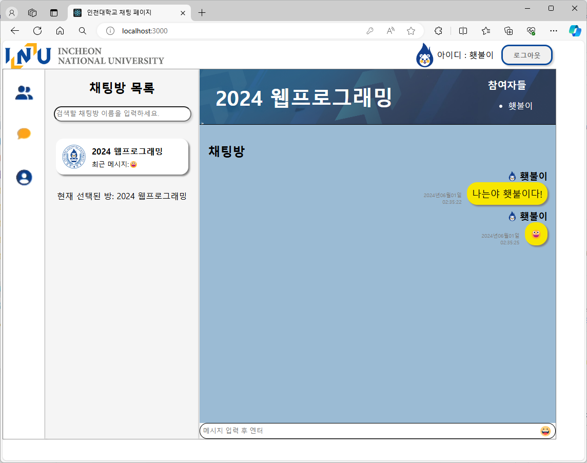

#### Dweb ❌ Incheon National University (INU)

## 🌟 다음과 같은 순서로 실행할 수 있습니다.
## 1. npm install
## 2. npm run build
## 3. npm start
## 4. 웹 브라우저에서 localhost:3000 접속
##
## 🌟 실행 화면

